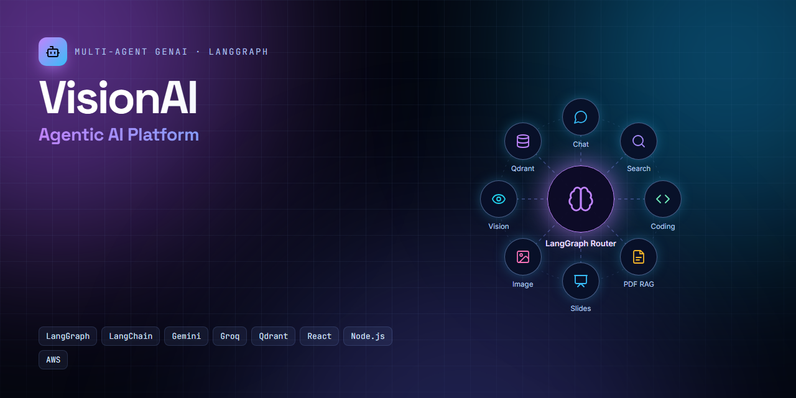
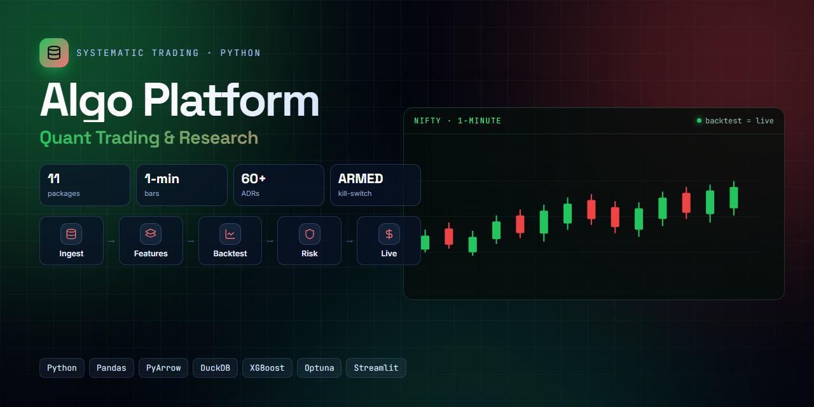
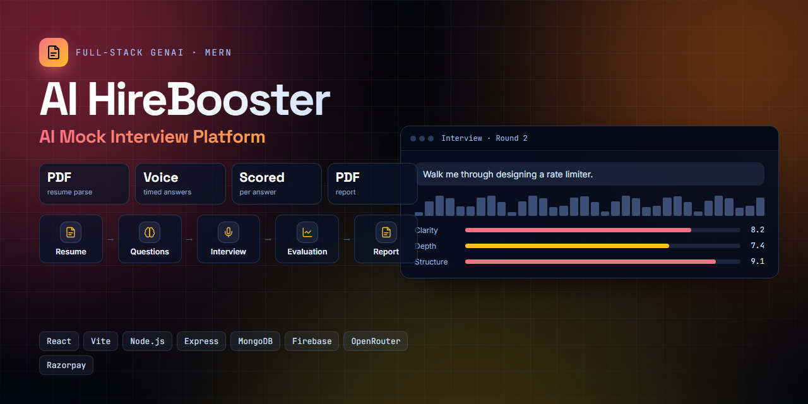
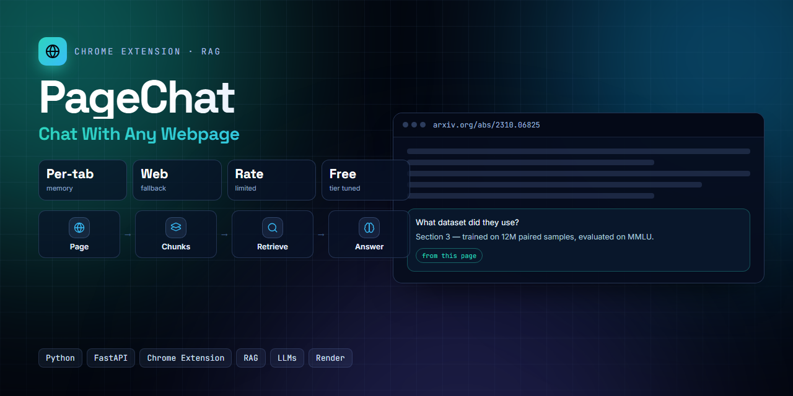
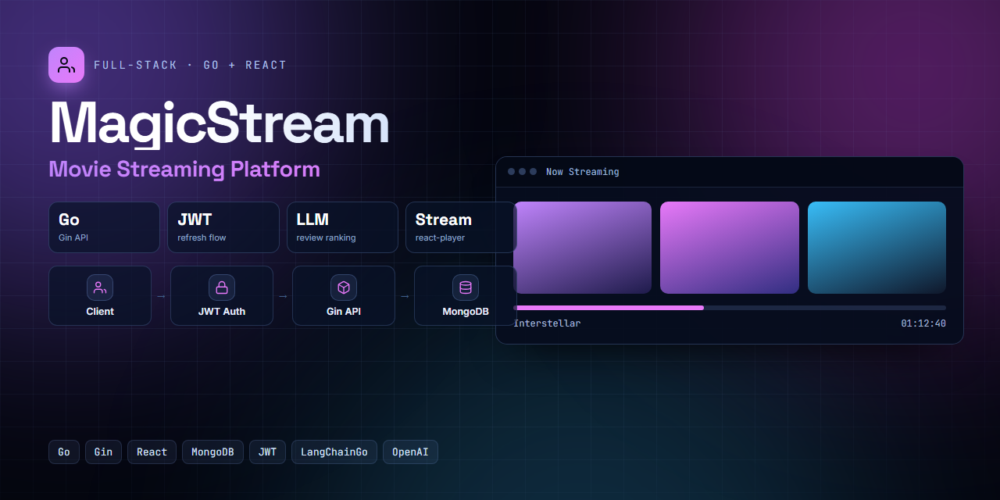
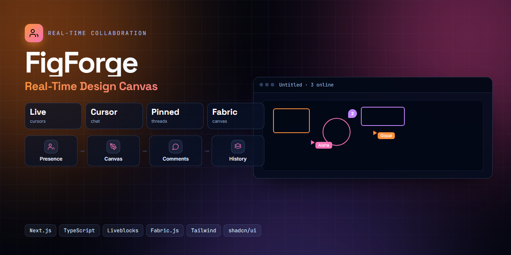
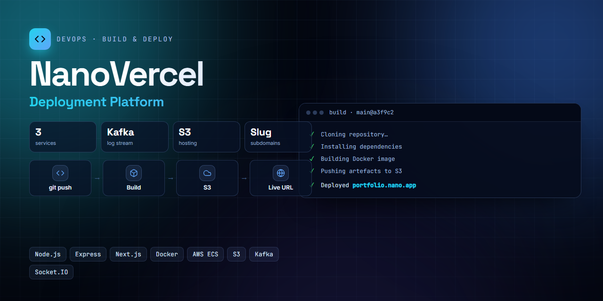

# Social preview thumbnails

GitHub repo social previews — **1280×640**, the size GitHub renders on link cards
(Settings → Social preview → Edit → upload).

Click any image to open it full size, then right-click → **Save image as…**

| | |
|:--:|:--:|
| **VisionAI** [`iitian-gopu/visionai`](https://github.com/iitian-gopu/visionai)  | **Algo Platform** `iitian-gopu/algo-platform` *(private)*  |
| **AI HireBooster** [`iitian-gopu/ai-hire-booster`](https://github.com/iitian-gopu/ai-hire-booster)  | **PageChat** [`iitian-gopu/pagechat`](https://github.com/iitian-gopu/pagechat)  |
| **MagicStream** [`iitian-gopu/magic-stream`](https://github.com/iitian-gopu/magic-stream)  | **FigForge** [`iitian-gopu/FigForge`](https://github.com/iitian-gopu/FigForge)  |
| **NanoVercel** [`iitian-gopu/vercel-clone`](https://github.com/iitian-gopu/vercel-clone)  | |

---

### Where each one goes

| Image | Repo |
|---|---|
| `visionai.png` | iitian-gopu/visionai |
| `algo-platform.png` | iitian-gopu/algo-platform |
| `ai-hire-booster.png` | iitian-gopu/ai-hire-booster |
| `pagechat.png` | iitian-gopu/pagechat |
| `magic-stream.png` | iitian-gopu/magic-stream |
| `figforge.png` | iitian-gopu/FigForge |
| `nanovercel.png` | iitian-gopu/vercel-clone |

The portfolio card thumbnails are a different shape and live in
[`public/projects/`](../projects) — they are sized to the card, not to GitHub.
